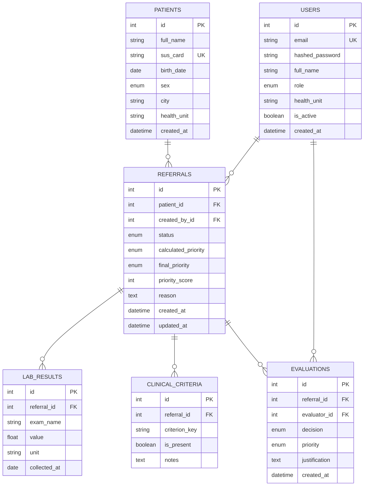
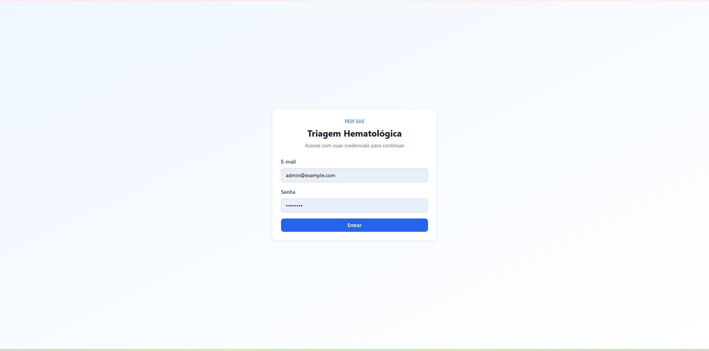
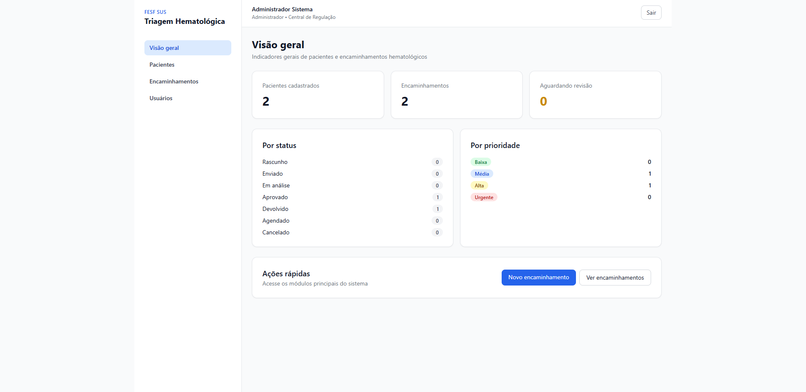
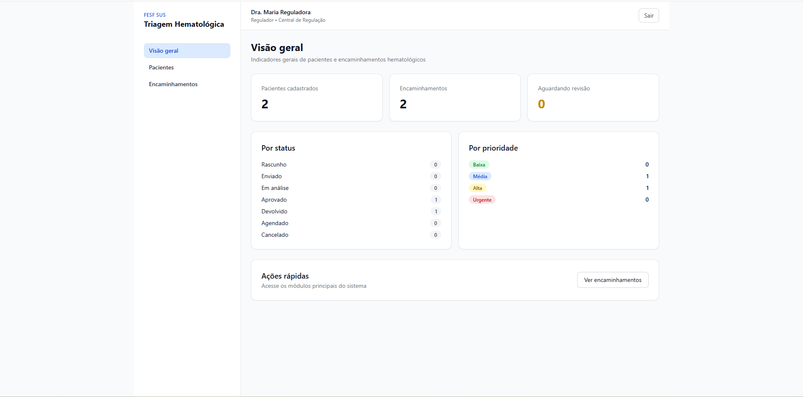
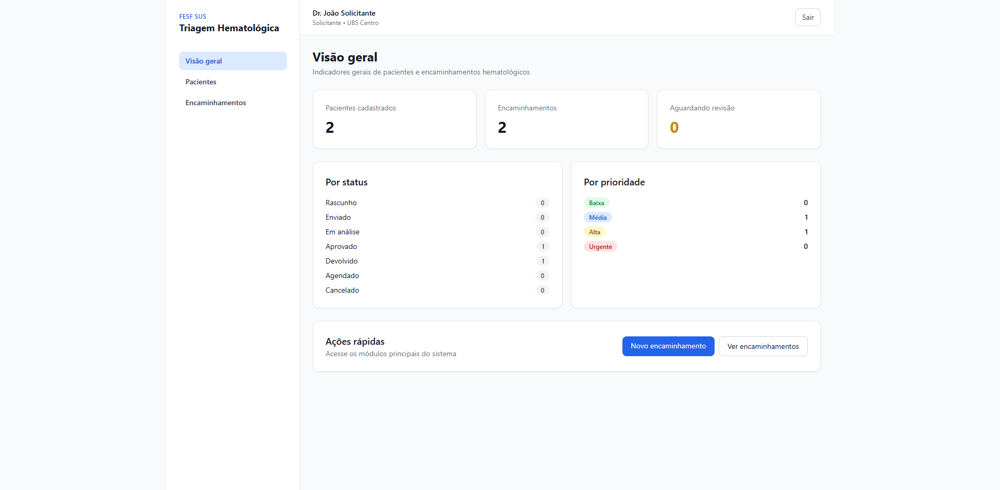

# Sistema de Triagem Hematológica — Portfólio FESF SUS

Repositório principal do portfólio **Seleção FESF-SUS**: sistema web completo para regulação de encaminhamentos hematológicos no SUS, com critérios padronizados, pontuação automática de prioridade e revisão auditável por reguladores.

**Stack:** FastAPI + SQLAlchemy + PostgreSQL (backend) | Next.js + Zustand + Tailwind (frontend) | Docker Compose

## Portfólio de repositórios

Este é o **produto principal**. Os repositórios abaixo comprovam competências específicas do BAREMA sobre o mesmo domínio:

| Item | Repositório | Foco |
|------|-------------|------|
| **01** | [Selecao-FESF-SUS-1-F.C](https://github.com/beaxmorais/Selecao-FESF-SUS-1-F.C) | FastAPI + SQLAlchemy + Next.js + Zustand |
| **02** | [Selecao-FESF-SUS-2-F.C](https://github.com/beaxmorais/Selecao-FESF-SUS-2-F.C) | Docker + OAuth2/JWT |
| **03** | [Selecao-FESF-SUS-3-F.C](https://github.com/beaxmorais/Selecao-FESF-SUS-3-F.C) | Redis/cache |
| **04** | [Selecao-FESF-SUS-4-F.C](https://github.com/beaxmorais/Selecao-FESF-SUS-4-F.C) | Testes Pytest (unitários + integração) |
| **Geral** | **Este repositório** | Sistema completo de triagem/regulação |

## Visão do projeto

A aplicação permite que unidades solicitantes cadastrem pacientes e encaminhamentos com sinais clínicos e exames laboratoriais. O backend calcula automaticamente a prioridade com base em regras explícitas. Reguladores revisam, confirmam ou ajustam a prioridade com justificativa. Administradores gerenciam usuários e acessam indicadores gerais.

**Perfis de usuário:**
- **Solicitante (`requester`)**: cadastra pacientes e encaminhamentos
- **Regulador (`regulator`)**: avalia e define prioridade final
- **Administrador (`admin`)**: gerencia usuários e visualiza todo o sistema

### Solicitante vs. Regulador

Os dois perfis participam do mesmo fluxo de regulação, mas em momentos diferentes:

| | Solicitante | Regulador |
|---|-------------|-----------|
| **Contexto** | Unidade de saúde solicitante (ex.: UBS) | Central de regulação |
| **Papel** | Produz a solicitação de encaminhamento | Analisa e decide sobre a solicitação |
| **Pacientes** | Cadastra, edita e consulta | Apenas consulta |
| **Encaminhamentos** | Cria, edita (rascunho/devolvido), envia e exclui rascunhos | Consulta e avalia os enviados |
| **Dados clínicos** | Preenche exames laboratoriais e critérios clínicos | Visualiza o que foi registrado |
| **Prioridade** | Vê a prioridade calculada automaticamente pelo sistema | Confirma ou ajusta a prioridade final |
| **Decisão final** | Não avalia | Aprova, devolve, agenda ou cancela — com justificativa quando necessário |

**Fluxo resumido:**

```
Solicitante                         Regulador
    │                                   │
    ├─ Cadastra paciente                │
    ├─ Cria encaminhamento              │
    ├─ Informa exames e critérios       │
    ├─ Sistema calcula prioridade       │
    └─ Envia para regulação ──────────► ├─ Analisa o caso
                                          ├─ Define prioridade final
                                          └─ Registra decisão e justificativa
```

O **administrador** concentra as permissões do solicitante e do regulador, além de gerenciar usuários e acessar todas as áreas do sistema.

## Diagrama de arquitetura

```
┌─────────────────┐     JWT/REST      ┌─────────────────┐
│   Next.js       │ ◄──────────────► │   FastAPI       │
│   (Zustand)     │                   │   (SQLAlchemy)  │
└─────────────────┘                   └────────┬────────┘
                                               │
                                               ▼
                                      ┌─────────────────┐
                                      │   PostgreSQL    │
                                      └─────────────────┘
```

## Setup via Docker (recomendado)

### Pré-requisitos

- Docker e Docker Compose instalados

### Passos

1. Clone o repositório e entre na pasta do projeto.

2. Copie as variáveis de ambiente:
   ```bash
   cp .env.example .env
   ```

3. Suba os serviços:
   ```bash
   docker compose up --build -d
   ```

4. Execute as migrations:
   ```bash
   docker compose exec backend alembic upgrade head
   ```

5. Popule dados de demonstração:
   ```bash
   docker compose exec backend python -m app.seed
   ```

6. Acesse:
   - **Frontend:** http://localhost:3000
   - **API / Swagger:** http://localhost:8000/docs

### Credenciais de demonstração

| Perfil      | E-mail                    | Senha      |
|-------------|---------------------------|------------|
| Admin       | admin@example.com          | admin123   |
| Solicitante | solicitante@example.com    | solicit123 |
| Regulador   | regulador@example.com      | regul123   |

## Setup local (sem Docker)

### Backend

```bash
cd backend
python -m venv .venv
.venv\Scripts\activate
pip install -r requirements.txt
cp ..\.env.example ..\.env
alembic upgrade head
python -m app.seed
uvicorn app.main:app --reload
```

### Frontend

```bash
cd frontend
npm install
npm run dev
```

Configure `NEXT_PUBLIC_API_URL=http://localhost:8000` se necessário.

## Lista de funcionalidades

- [ ] Login/logout funcional com JWT
- [ ] CRUD completo de pacientes e encaminhamentos
- [ ] Registro de critérios clínicos e exames laboratoriais
- [ ] Cálculo automático de prioridade por regras explícitas
- [ ] Revisão do regulador com justificativa e histórico
- [ ] Roles `admin`, `requester` e `regulator` respeitadas
- [ ] Dashboard com indicadores por status e prioridade
- [ ] PostgreSQL via Docker Compose
- [ ] Migrations Alembic aplicáveis
- [ ] Swagger documentado em `/docs`

## Estrutura do projeto

```
Selecao-FESF-SUS/
├── backend/          # API FastAPI + SQLAlchemy + Alembic
├── frontend/         # Next.js + Zustand + Tailwind
├── docker-compose.yml
└── .env.example
```


## Endpoints principais

- `POST /api/v1/auth/login` — OAuth2 
- `GET /api/v1/auth/me`
- CRUD `/api/v1/patients`
- CRUD `/api/v1/referrals`
- `POST /api/v1/referrals/{id}/submit`
- `POST /api/v1/referrals/{id}/evaluate`
- `GET /api/v1/reports/dashboard`

## Diagrama das tabelas



## Documentação adicional

- [backend/README.md](backend/README.md) 

Antes do login: 



Visão do administrador: 



Visão geral do regulador: 



Visão geral do solicitante: 

