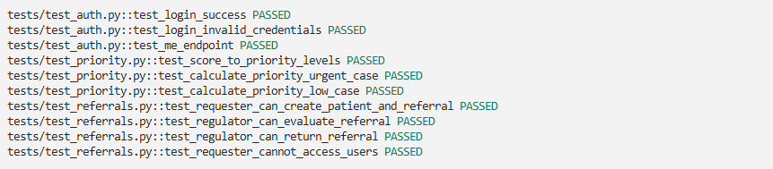

# Backend - Triagem Hematológica

API FastAPI com SQLAlchemy e PostgreSQL.

## Desenvolvimento local

### Windows

```bash
cd backend
python -m venv .venv
.venv\Scripts\activate
pip install -r requirements.txt
cp ..\.env.example ..\.env
alembic upgrade head
python -m app.seed
uvicorn app.main:app --reload
```

### Linux/macOS

```bash
cd backend
python -m venv .venv
source .venv/bin/activate
pip install -r requirements.txt
cp ../.env.example ../.env
alembic upgrade head
python -m app.seed
uvicorn app.main:app --reload
```

## Testes

```bash
pytest tests/ -v
```

Resultado da execução dos testes:



Documentação interativa: http://localhost:8000/docs
